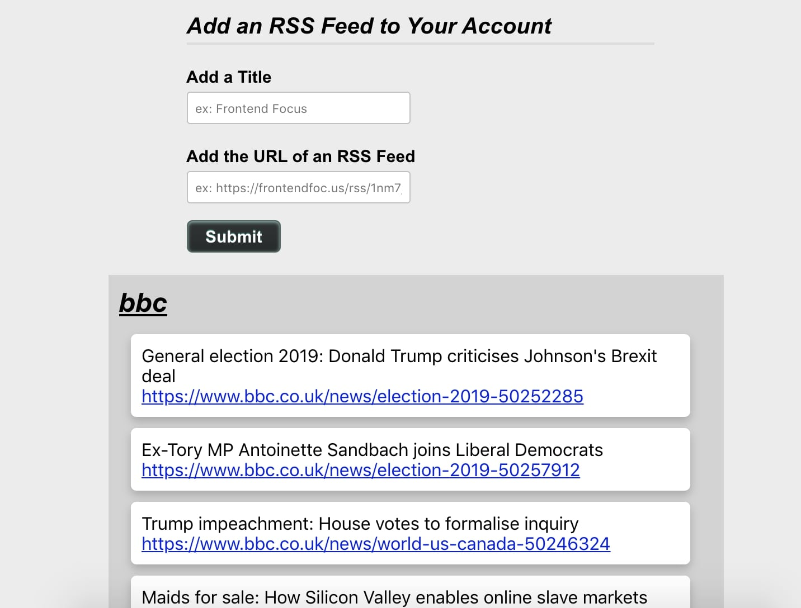
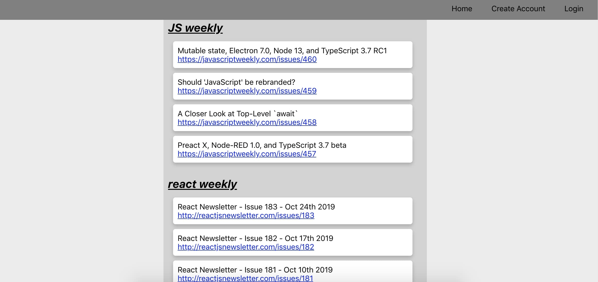

# Newsletter Inbox API

<a href="https://ryan-newsletter-app.now.sh/">Live App</a>

## About

"Newsletter Inbox" is a web app that allows users to collect their favorite weekly newsletters
and view them on one page. The app provides an easy-to-use alternative to having your email inbox
spammed with weekly newsletters.

### Usage

To try the app out, use the following test account:
Username: testuser123
Password: testpw123

The test account comes with several newsletters already added.

To add a new newsletter to your feed, copy and paste a url from an RSS feed into the second input and give it a title.

For example:
Title: Frontend Focus
RSS URL: https://frontendfoc.us/rss/1nm7je3m

### Technologies Used (frontend)

- React.js
- CSS

This project was bootstrapped with [Create React App](https://github.com/facebook/create-react-app).

## Start the app

### `npm start`

Runs the app in the development mode. 
Open [http://localhost:3000](http://localhost:3000) to view it in the browser.

The page will reload if you make edits. 
You will also see any lint errors in the console.
